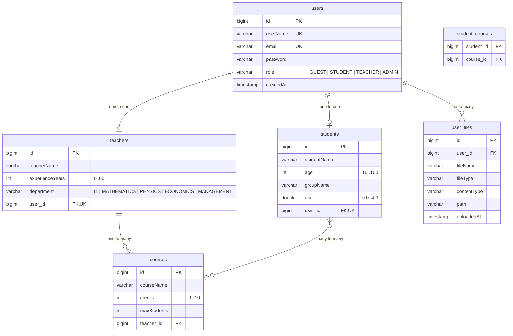

# ER Diagram

## Relationships

| Relationship | Type | Description |
|---|---|---|
| `users` -- `students` | One-to-One | Each student is linked to exactly one user account |
| `users` -- `teachers` | One-to-One | Each teacher is linked to exactly one user account |
| `users` -- `user_files` | One-to-Many | A user can upload multiple files (avatar, documents) |
| `teachers` -- `courses` | One-to-Many | A teacher can teach multiple courses |
| `students` -- `courses` | Many-to-Many | Students enroll in courses via `student_courses` join table |
